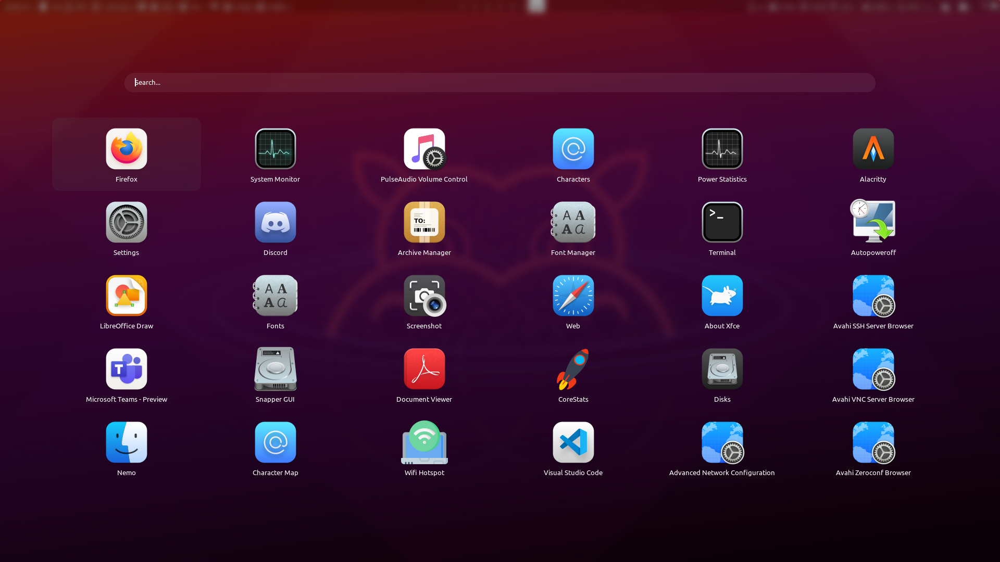
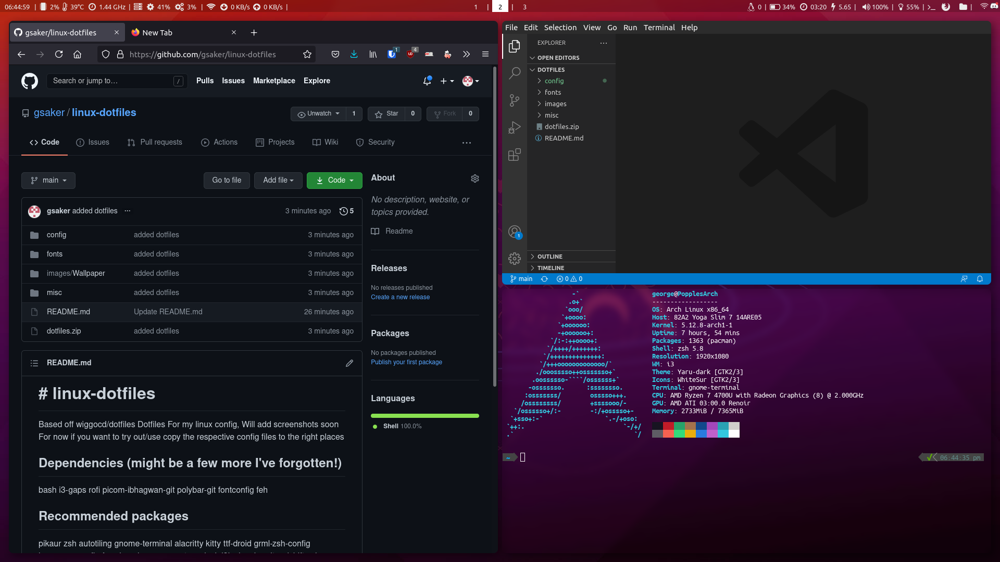

<h1># linux-dotfiles </h1>
Based off wiggocd/dotfiles
Dotfiles For my linux config, Will add screenshots soon
For now if you want to try out/use copy the respective config files to the right places
<h1> Screenshots </h1>

<h2>Dependencies</h2>

Install dependencies in installedpackages.txt and instaleldAURpackages.txt
